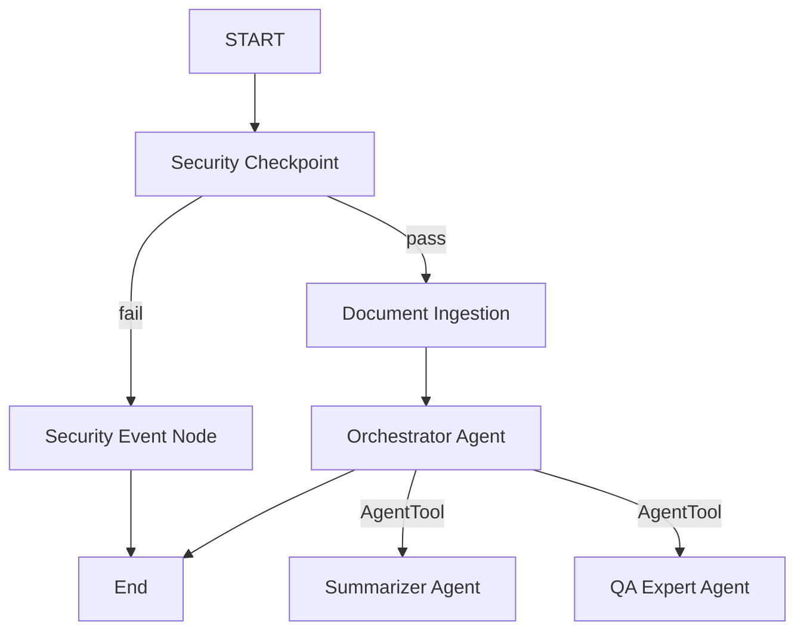

# SUBMISSION WRITE-UP — doc-summarizer

## Problem Statement
In today's fast-paced academic, professional, and research environments, individuals are overwhelmed by the volume of long documents, research papers, emails, and reports they must read daily. Extricating critical details, generating high-quality summaries, and getting quick answers to specific queries is highly time-consuming. `doc-summarizer` addresses this problem by acting as an intelligent conversational partner that automates secure document summarization, metadata extraction, and Q&A.

---

## Solution Architecture

The system utilizes a structured, graph-based workflow layout built on Google ADK 2.0 to coordinate multiple specialized agents and ensure safety policies:

---

## Concepts Used

1. **ADK Workflow (Graph API):**
   Expressed in [app/agent.py](file:///c:/Users/ANIKET%20PAL/Downloads/Sum_agent/doc-summarizer/app/agent.py) as `doc_summarizer_workflow`. It maps nodes (`security_checkpoint`, `document_ingestion`, `orchestrator_agent`, etc.) and routes (`pass`, `fail`) to direct user input dynamically.
2. **LlmAgent:**
   Used for specialized sub-agents (`summarizer_agent` and `qa_expert`) and the coordinator (`orchestrator_agent`) in [app/agent.py](file:///c:/Users/ANIKET%20PAL/Downloads/Sum_agent/doc-summarizer/app/agent.py).
3. **AgentTool:**
   Wired to `orchestrator_agent` in [app/agent.py](file:///c:/Users/ANIKET%20PAL/Downloads/Sum_agent/doc-summarizer/app/agent.py) to enable seamless routing and task delegation to `summarizer_agent` and `qa_expert`.
4. **MCP Server:**
   Created in [app/mcp_server.py](file:///c:/Users/ANIKET%20PAL/Downloads/Sum_agent/doc-summarizer/app/mcp_server.py) using the Model Context Protocol (MCP) Python SDK to provide local and remote document operations (file reading, web page fetching, file writing, metadata analysis).
5. **Security Checkpoint:**
   Implemented as `security_checkpoint` in [app/agent.py](file:///c:/Users/ANIKET%20PAL/Downloads/Sum_agent/doc-summarizer/app/agent.py) to validate inputs before processing.
6. **Agents CLI:**
   Used to scaffold (`agents-cli scaffold create`), install (`agents-cli install`), and run local playground (`make playground`).

---

## Security Design

1. **PII Scrubbing:** 
   Uses a regular expression in `security_checkpoint` to scrub email addresses from documents and queries to prevent leaks of sensitive contact information.
2. **Prompt Injection Mitigation:** 
   Monitors input for keywords like `"ignore previous instructions"`, `"system prompt"`, and `"override rules"`. If found, routes the execution to `security_event` to block the malicious message immediately.
3. **Confidentiality Check (Domain Rule):**
   Flags inputs containing markers like `"confidential"`, `"internal only"`, or `"proprietary"`, printing a Warning-level structured JSON audit log.
4. **Structured JSON Audit Logs:**
   Prints machine-readable audit logs for every decision (INFO on clean pass, WARNING on confidentiality detection, CRITICAL on blocked injection) for compliance.

---

## MCP Server Design

Our custom Model Context Protocol server (in [app/mcp_server.py](file:///c:/Users/ANIKET%20PAL/Downloads/Sum_agent/doc-summarizer/app/mcp_server.py)) implements these tools:
- **`read_document_file`:** Allows the agents to read local documents and raw text/markdown notes directly from the workspace.
- **`fetch_webpage_content`:** Enables fetching external web page/article text directly from URLs.
- **`extract_document_metadata`:** Calculates word counts, character counts, and estimated reading times to give users context on the file.
- **`save_summary_to_file`:** Safely writes summaries to disk for user retrieval.

Both `summarizer_agent` and `qa_expert` are equipped with this toolset.

---

## HITL Flow (Human-in-the-Loop)

If the user asks for a summary or question but the agent has not yet stored any document text in `ctx.state["document_content"]`, the `document_ingestion` node pauses the flow and yields a `RequestInput(interrupt_id="ask_document")` event.
Once the user provides the document content, the workflow resumes, stores it in session state, and proceeds. This avoids the model failing or hallucinating due to missing context.

---

## Demo Walkthrough

1. **Normal Summary Case:** User posts text. The security check passes. The orchestrator delegates to the summarizer, returning a clean summary.
2. **PII Scrubbing Case:** User posts text containing `team@deepmind.com`. The checkpoint scrubs it, and the rest of the text is processed safely.
3. **Injection Block Case:** User tries to bypass safety with `ignore previous instructions`. The checkpoint detects it and displays a safety violation block.

---

## Impact & Value Statement
`doc-summarizer` reduces reading time for students, researchers, and professionals by up to 90%, enabling quick content digests and interactive conversations without compromising privacy or security.
